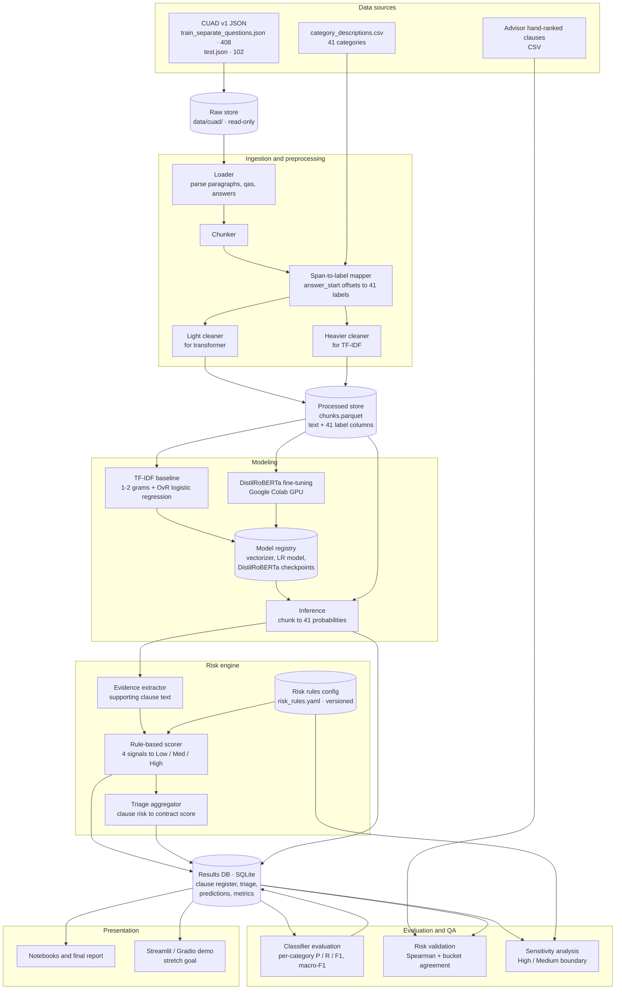
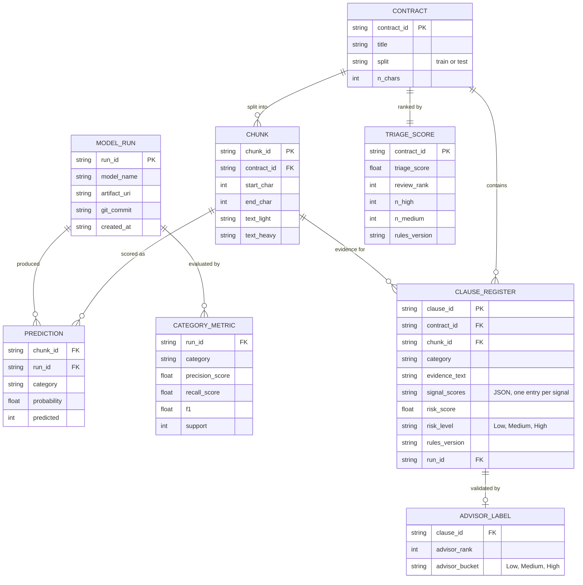

# System Architecture: CUAD Contract Review Pipeline

**Accenture AI Studio Challenge · Break Through Tech AI Studio, Fall 2026**

> **Status:** living document. Items marked **Frozen** are decisions the team has already locked. Items marked **Proposed** are suggestions to confirm with the team before building.

---

## 1. Context and goals

Legal and procurement teams review tens of thousands of contracts a year, but only a small number of clauses in each carry real risk. This system reads a contract, detects which of the 41 CUAD clause categories appear in it, assigns each detected clause a Low / Medium / High risk level using explainable rules, and rolls those up into a contract-level triage score so reviewers know which contracts to open first.

Design priorities, in order:

1. **Auditability.** Every risk score must trace back to the clause text, the model run, and the rule version that produced it.
2. **Reproducibility.** Any result in the final report can be regenerated from the repo, the config, and a recorded model run.
3. **Simplicity.** A five-person student team on Colab, so no servers to maintain.

---

## 2. High-level architecture

Cylinders are persistent stores. Rectangles are processing components.



---

## 3. Results database schema

The Results DB is the single source of truth for everything downstream of the classifier. Chunk labels for training live in the Parquet file. The DB holds what the system *produces*.



**Why `run_id` and `rules_version` appear everywhere:** they are what make a risk score auditable. Any row in the clause register can answer "which model flagged this, and which version of the rules scored it?"

---

## 4. Components

| Component | Layer | Input | Output | Status |
|---|---|---|---|---|
| Loader | Preprocessing | Raw CUAD JSON | Contract text + answer spans | Frozen (official split, no PDF parsing) |
| Chunker | Preprocessing | Contract text | Chunks with character offsets | Frozen (function frozen in Task 2) |
| Span-to-label mapper | Preprocessing | Chunks + `answer_start` spans | 41 binary labels per chunk | Frozen (SQuAD 2.0 to multi-label) |
| Light / heavier cleaners | Preprocessing | Labeled chunks | Two cleaned text columns | Frozen (applied after mapping) |
| TF-IDF baseline | Modeling | Heavier-cleaned text | Vectorizer + LR model | Frozen (1-2 grams, OvR LR, macro-F1) |
| DistilRoBERTa trainer | Modeling | Light-cleaned text | Fine-tuned checkpoint | Frozen model choice; imbalance strategy TBD |
| Inference | Modeling | Chunks + checkpoint | 41 probabilities per chunk | Proposed |
| Evidence extractor | Risk engine | Predictions | Supporting clause text per category | Proposed |
| Rule-based scorer | Risk engine | Evidence + `risk_rules.yaml` | Risk level per clause | Proposed (four signals TBD) |
| Triage aggregator | Risk engine | Clause risk levels | Contract triage score + rank | Proposed |
| Classifier evaluation | Evaluation | Predictions + gold labels | Per-category metrics | Frozen metric (macro-F1) |
| Risk validation | Evaluation | Clause register + advisor CSV | Spearman, bucket agreement | Proposed |
| Sensitivity analysis | Evaluation | Rules config + DB | Boundary stability report | Proposed |

---

## 5. Storage choices

| Store | Technology | Contents | Why this choice | Status |
|---|---|---|---|---|
| Raw store | Files in `data/cuad/` | Official CUAD JSON + category CSV | Never modified, so preprocessing is always rerunnable | Frozen |
| Processed store | Parquet | One row per chunk: ids, offsets, both cleaned texts, 41 label columns | Columnar and compact for 41 label columns; loads straight into pandas and HF Datasets | Proposed |
| Model registry | Shared Google Drive folder (or Hugging Face Hub) | Pickled vectorizer + LR, DistilRoBERTa checkpoints | Colab disks reset every session; checkpoints are too large for git | Proposed |
| Risk rules config | YAML in git | Signal weights, thresholds, category risk tiers | Rules are reviewable in pull requests, and every change gets a version | Proposed |
| Results DB | SQLite file | Clause register, triage scores, predictions, metrics, advisor labels | Single file, no server, queryable with SQL, easy to hand to the advisor | Proposed |

**Trade-off note.** SQLite is the right size for 510 contracts. It would need to become Postgres only if the system served many concurrent users, which is outside this project's scope.

---

## 6. Runtime environments

| Environment | Used for |
|---|---|
| Google Colab (GPU) | DistilRoBERTa fine-tuning and batch inference |
| VS Code / Jupyter (local) | Preprocessing, baseline, risk engine, EDA, error analysis |
| GitHub | Code, configs, docs, GitHub Projects board |
| Shared Google Drive | Model checkpoints and large processed files |

---

## 7. Key decisions and trade-offs

**Frozen**

- **Official train/test split, no re-splitting.** Keeps the split at the contract level to prevent leakage and keeps results comparable to the CUAD paper.
- **Cleaning runs after span-to-label mapping.** Cleaning changes character positions, so it must come after `answer_start` offsets are used.
- **Two cleaning functions.** The transformer needs text close to the original. TF-IDF benefits from more normalization.
- **Macro-F1 as the headline metric.** CUAD is heavily imbalanced, so accuracy is misleading.
- **Rule-based risk scoring.** No ground-truth risk labels exist, and explainability matters more than raw capability here.

**Known data caveats to carry through every report**

- Price Restriction has no examples in the official test set.
- The dataset contains slightly more annotations than the CUAD paper reports.

---

## 8. Repo layout

**Status: implemented.** The directory tree below exists in the repo. Package
directories under `src/` currently hold only `__init__.py` docstrings describing
what belongs in each — the modules themselves are written as their milestones
come up.

```
Accenture-1Q-contract-review-challenge/
├── data/
│   ├── cuad/                 # raw store (read-only)
│   └── processed/            # chunks.parquet (gitignored if large)
├── configs/
│   └── risk_rules.yaml       # versioned risk rules
├── src/
│   ├── ingest/               # loader, chunker, span-to-label mapper
│   ├── clean/                # light + heavier cleaners
│   ├── models/               # baseline + DistilRoBERTa train / infer
│   ├── risk/                 # evidence extractor, scorer, triage
│   ├── db/                   # SQLite schema + read/write helpers
│   └── eval/                 # metrics, Spearman, sensitivity
├── notebooks/                # EDA, error analysis
├── results/
│   └── cuad_results.db       # results DB (gitignored)
├── app/                      # Streamlit / Gradio demo (stretch)
├── reports/                  # final report, figures
└── docs/
    └── ARCHITECTURE.md       # this file
```

What `.gitignore` keeps out: `data/processed/*.parquet`, `results/*.db`, model
checkpoints (`*.pt`, `*.bin`, `*.safetensors`, `*.pkl`), `__pycache__/`, and
`.ipynb_checkpoints/`. Everything ignored is regenerable from `data/cuad/` plus
committed code and configs.

`data/cuad/` is committed as-is (about 98 MB) so the team shares one fixed copy
of the official split. `data/processed/contract_categories.jsonl` is committed
too, at 9 MB; if processed artifacts grow, move them to shared Drive rather than
letting the repo balloon.

---

## 9. Open questions for the team

1. Where do model checkpoints live: shared Google Drive or a private Hugging Face Hub repo?
2. What are the four risk signals, and which ones depend on model confidence versus fixed category tiers?
3. What format will the advisor's hand-ranked clauses arrive in, and how do we match them to `clause_id`?
4. How do we handle class imbalance in DistilRoBERTa training: weighted loss, resampling, or per-category thresholds?
